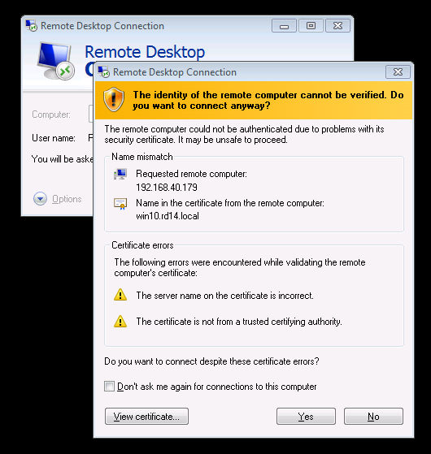

Attacking RDP
=============

The Remote Desktop Protocol (RDP) is used by system administrators everyday
to log onto remote Windows machines. Perhaps most commonly, it is used to
perform administrative tasks on critical servers such as the domain
controller with highly privileged accounts, whose credentials are
transmitted via RDP. It is thus vital to use a secure RDP configuration.

We at SySS regularly observe that due to misconfigurations, system
administrators in an Active Directory environment are routinely presented
with (and ignore) certificate warnings like this:

If warnings like these are a common occurrence in your environment, you
won't be able to recognize a real Man-in-the-Middle (MitM) attack.

This article was written to show you how important it is to take certificate
warnings seriously and how to securely configure your Windows landscape. The
intended audience is system administrators, pentesters and security
enthusiasts. While not necessary, it is recommended that you have a firm
understanding of the following subjects:

* Public key cryptography as well as symmetric cryptography (RSA and RC4)
* SSL
* x509 certificates
* TCP
* Python
* Hexadecimal numbers and binary code

We will demonstrate how a MitM can sniff your credentials if you aren't
careful. None of this is particularly new - it even has been done before,
for example by [Cain](http://www.oxid.it/cain.html). However, Cain is rather
old, closed source and only available for Windows. We want to analyze all
the gory details and relevant inner workings of RDP and simulate a real
attack on it as closely as possible.

It should go without saying that the findings in this article must not be
used to gain unauthorized access to any system you do not own. They may only
be used for educational purposes with the full consent of the systems'
owner. Otherwise, you will most likely break the law depending on your
jurisdiction.

A first look at the protocol
----------------------------

Let's fire up Wireshark and see what happens when we connect to a server via
RDP:

As we can see, the client starts with a suggestion of security protocols to
use for the RDP session. In this case, the client is capable of these protocols:

* Standard RDP security
* Enhanced RDP security
* CredSSP

Note that standard RDP security is always possible and does not need to be
advertised by the client. TLS, or "enhanced RDP security", is simply standard
RDP security wrapped inside an encrypted TLS tunnel. By the way, I'll be
using the terms SSL and TLS interchangeably throughout this article.

CredSSP is also inside an TLS tunnel, but instead of transmitting the
password in the protected tunnel, NTLM or Kerberos is used for
authentication. This protocol is also referred to as Network Level
Authentication (NLA).

Early user authentication is a feature that allows the server to deny access
even before any credentials (except for the username) have been submitted, for
example if the user does not have the necessary remote access privileges.

In our Wireshark session, we can see that an SSL handshake is performed after
client and server have agreed on using enhanced RDP security. For this, we
right click on the first package after the negotiation packages, and decode
the TCP stream as SSL:

So if we want to MitM an RDP connection, we can't simply use an SSL proxy,
because the proxy needs to be aware of the RDP. It needs to recognize when
to initiate the SSL handshake, similarly to StartTLS in SMTP or FTP. We
choose Python to implement such a proxy. For this we simply create a server
socket that the victim's client connects to, and a client socket that
connects to the actual server. We forward the data between these sockets and
wrap them in an SSL socket if necessary. Of course, we will be closely
inspecting and possibly modifying said data.

The first thing we'll want to modify is the client's protocol capabilities.
The client may want to tell the server that it can do CredSSP, but we'll
change that on the way to the server to standard RDP security. And in the
default configuration, the server will happily comply.

Building a Python MitM proxy for RDP
------------------------------------

Breaking standard RDP security
------------------------------

Actually, there isn't much to break. It's already completely broken by
design, and I'll tell you why.

The way standard RDP security works is this:

* The client announces its intention to use the standard RDP security
  protocol.
* The server agrees and sends its own RSA public key (also called
  "certificate") along with a "Server Random" to the client. The certificate
  is signed using the Terminal Services private key to ensure authenticity.
* The client validates the certificate by using the Terminal Services public
  key. If successful, it uses the server's public key to encrypt the "Client
  Random" and sends it to the server.
* The server decrypts the Client Random with its own private key.
* Both server and client [derive the session keys](https://msdn.microsoft.com/en-us/library/cc240785.aspx)
  from the Server Random and the Client Random. These keys are used for
  symmetrically encrypting the rest of the session.

Note that all of this happens in plain text, not inside an SSL tunnel.
That's fine in principle, Microsoft simply tried to implement the same
techniques which SSL employs themselves. However, [cryptography is
hard](https://www.schneier.com/essays/archives/1997/01/why_cryptography_is.html),
and as a general rule, you should always rely on established solutions that
stood the test of time instead of implementing your own.

Can you spot the mistake here? How does the client get the Terminal Services
public key? The answer is: It comes pre-installed. That means it's the same
key on every system. And THAT means the private key is also always the same!
So it can be extracted from any Windows installation. In fact, we don't even
need to do that, since by now Microsoft has decided to officially publish it
and we can simply look it up at
[microsoft.com](https://msdn.microsoft.com/en-us/library/cc240776.aspx).

The symmetric encryption after the session keys have been derived can be
done on [several levels](https://msdn.microsoft.com/en-us/library/cc240787.aspx):
None, 40 bit RC4, 56 bit RC4, 128 bit RC4, or 3DES (they call it FIPS). The
default is 128 bit RC4 ("High"). But if we can eavesdrop on the key, it
doesn't matter how strong the encryption is at all.

So the plan is clear: When encountering the server's public key, we
quickly generate our own RSA key pair of the same size and overwrite the
original key with it. Of course, we need to generate a signature of our
public key using the Terminal Services private key and replace the original
signature with it. Then, after the client successfully validates our bogus
public key, we receive its Client Random. We decrypt it using our private
key, write it down for later and reencrypt it using the server's public key.
That's it! From then on we can passively read the encrypted traffic between
client and server.

The only challenge is to properly parse the RDP packages.

<pre>
RSA1
</pre>

<pre>
03 00 ...
</pre>

Let's try it out. Upon connecting to our bogus RDP server, we already get a
warning that the server's authenticity cannot be verified:

Notice something? It's not an SSL warning.

By the way, this is what Cain is doing.

Breaking enhanced RDP security
------------------------------

To me, downgrading to standard RDP security is unsatisfactory. If I were an
attacker, I'd try to make the attack look as inconspicuous as possible. The
victim will notice a different warning than usual and that it has to
enter their credentials after the connection has already been established.

It always bugged me that I don't see the same SSL warning when I MitM the
RDP connection. I find it hard to explain to a customer why they have to
take SSL warnings seriously, especially if they use self-signed certificates
which can't possibly be verified, if this MitM tool causes a completely
different warning to be shown.

So let's try to downgrade the connection to enhanced RDP security. For this,
we need our own SSL certificate, which can be generated by OpenSSL:

    openssl ...

We wrap our Python TCP sockets inside SSL sockets at the right time and
we're done. I said earlier that the standard RDP protocol is being used
inside the SSL tunnel, but the server always chooses "None" as the
encryption level. That's fine, since it can be safely assumed that the SSL
wrapper ensures the authenticity and integrity of the data. Using RC4 on top
of SSL is a needless waste of resources.

Let's try it out:

As expected, we get a proper SSL warning. But something is still different.
Instead of being prompted for our credentials before the RDP connection is
established, we are faced with the windows logon screen. Again, that's
something that is different from the typical workflow of an admin and could
be noticed.

Breaking CredSSP
----------------

Okay, I'll admit it right here: We're not going to break CredSSP. But we'll
find a way to circumvent it.

First, let's see what happens if we don't downgrade the connection at all:

As a side remark, note that we didn't get an SSL warning. According to the
specifications, the client will send the SSL certificate's fingerprint to
the server encrypted with the key negotiated by the CredSSP protocol after
it has been authenticated. If it doesn't match the fingerprint of the
server's certificate, the session is terminated.

What we are looking at here is [NTLM
authentication](https://msdn.microsoft.com/en-us/library/aa378749%28VS.85%29.aspx).
It's a challenge-response technique where the client maps a Server Challenge
(similar to the Server Random from earlier), a Client Challenge, and the
hash of the user's password together with some other values onto a
cryptographic hash value. This value is then transmitted to the server. It
cannot be replayed or used for Pass-the-Hash attacks. But it can be
subjected to password guessing attacks! It's using HMAC-MD5, which is a
fairly cheap hash algorithm (so we can do many guesses per second) but it is
also using a salt (which rules out rainbow tables).

<pre>
Values needed for JtR hash
</pre>

So this is better than nothing. We can still try to crack it with [HashCat](https://hashcat.net/hashcat/) or
[John The Ripper](http://www.openwall.com/john/). But we can do better.

The question we need to ask ourselves is: How does the server verify the
NTLM response? It asks the domain controller. What if the domain controller
is not available? It says "screw it, let's do enhanced RDP security instead
of NLA", and the client will comply. And the kicker is: Since the client
already cached the user's password, it will simply transmit it instead of
directing the user to the Windows login screen! That's precisely what we
wanted. Except for the SSL warning (which the victim might be used to
anyway), nothing suspicious will happen at all.

So what we do is this: After the client sends its NTLM response, we'll
replace the server's answer with this:

<pre>
00000000: 300d a003 0201 04a4 0602 04c0 0000 5e    0.............^
</pre>

I couldn't find documentation on this anywhere (if you did, please write me
an e-mail), but this is what the server responds with if it can't contact
the domain controller. The client will fall back to enhanced RDP security,
show the SSL warning, and transmit the password inside the SSL tunnel to the
server.

Weaponizing this attack
-----------------------

The rest is simply a finger exercise. Until now, we have been dealing with a
lab environment. The victim won't be entering our IP in the RDP client, it
will be entering the IP or the host name of their own server. There are a
number of ways to gain a MitM position, but here we will choose ARP
spoofing. It's easy enough to do for a moment to demonstrate this as a proof
of concept. We do need to be on the same subnet as our victim, though.

After we spoofed the ARP replies and enabled forwarding of IPv4 traffic,
all communications between the victim and the gateway will run through our
machine. Since we still don't know the IP address the victim entered, we can't
run our Python script yet.

First, we create an `iptables` rule that redirects traffic coming from the
victim intended for an RDP server to our host:

    iptables -t nat -A PREROUTING -p tcp -s $VICTIM_IP --dport 3389 \
        -j DNAT --to-destination $ATTACKER_IP:3389

Second, we wait for a TCP SYN packet with destination port 3389 from the
victim.  We use `tcpdump` for this:

    tcpdump -n -c 1 -i "$IFACE" src host "$VICTIM_IP" and \
        "tcp[tcpflags] & tcp-syn != 0" and \
        dst port 3389 2> /dev/null  | \
        sed -e  's/.*> \([0-9.]*\)\.3389:.*/\1/'

The `-c 1` options tells `tcpdump` to exit after the first matching packet.
This SYN packet will be lost, since our service isn't running yet. But that
doesn't really matter, it will only be a short while before the victim's
system will try again. We don't want to capture any other packets, since
they would most likely belong to an already active RDP connection. Note that
this will disrupt active RDP connections of the victim, so you need to warn
them in advance. Don't do it without permission!

Third, we'll retrieve the SSL certificate of the RDP server and create a new
self-signed certificate that has the same common name as the original
certificate. We could also fix the certificate's expiration date, and it
will be literally indistinguishable from the original unless you take a
long, hard look at its fingerprint. I wrote a [small Bash script](...) to
do the job for us.

At this point we have all the information we need to run our Python script:

    rdp-cred-sniffer.py -c "$CERTPATH" -k "$KEYPATH" "$ORIGINAL_DEST"

Recommendations
---------------

Now you're probably wondering what you, as a system administrator, can do
about all of this to keep your network secure.

First of all, it is absolutely critical that RDP connections cannot happen
if the SSL certificate is not signed by a trusted certificate authority (CA).
Clients must to be configured via Group Policy Objects to disallow
connections if the certificate cannot be validated.

Computer configuration -> Policies -> Administrative Templates -> Windows
Components -> Remote Desktop Services (or Terminal Services) -> Remote
Desktop Connection Client -> Configure server authentication for client

https://technet.microsoft.com/en-us/library/cc753945(v=ws.10).aspx

Next, servers must insist on using CredSSP (NLA).  This can also be rolled
out as a group policy.

... -> Remote Desktop Services -> Remote Desktop Session Host (or Terminal
Server) -> Security -> Require user authentication for remote connections by
using Network Level Authentication

https://technet.microsoft.com/en-us/library/cc771869(v=ws.10).aspx

If you cannot use solely NLA due to compatibility reasons, you must sign all
server certificates with your enterprise root CA and disallow standard RDP
security. Set to TLS:

... Require use of specific security layer for remote connections

Lastly, you are encouraged to educate your colleagues and users that SSL
warnings are not to be taken lightly. As the administrator, you are
responsible for making sure that your client systems have your CA in their
list of trusted CAs. This way, these warnings should be the exception rather
than the rule and warrant a call to the IT department.

If you have any more questions or comments, just [let me
know](mailto:rdp@vollmer.syss.de).

- Dr. Adrian Vollmer, IT Security Consultant at SySS GmbH
